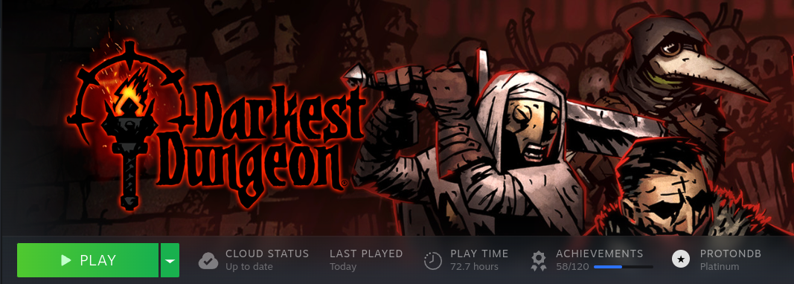

# Proton Check 

A Millennium plugin that allows you to instantly see the ProtonDB compatibility medal for a game.

The plugin was vibe-coded with [steam-size-on-disk](https://github.com/k0d13/steam-size-on-disk) used as a basis. 
Any checks, PRs, and contributions are welcome but don't expect me to fix much by myself as i'm a network guy
---

## Prerequisites

- [Millennium](https://steambrew.app/)
